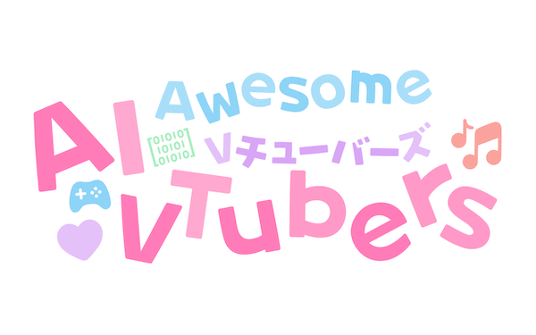

  <picture>
    <source
      width="480"
      srcset="./assets/logo-dark.png"
      media="(prefers-color-scheme: dark)"
    />
    <source
      width="480"
      srcset="./assets/logo-light.png"
      media="(prefers-color-scheme: light), (prefers-color-scheme: no-preference)"
    />
    
  </picture>

<h1 align="center">Awesome AI VTubers</h1>

A curated list of AI VTubers and their related projects

## Open Source Projects

- [A](#a)
- [B](#b)
- [E](#e)
- [M](#m)
- [O](#o)
- [S](#s)
- [V](#v)
- [Z](#z)

### A

- [AIRI (アイリ)](https://github.com/moeru-ai/airi)

  A container of souls of AI waifu / virtual characters to bring them into our worlds, wishing to achieve Neuro-sama's altitude, completely LLM and AI driven, capable of realtime voice chat, Minecraft playing, Factorio playing. Can be run in Browser or Desktop. Built with many support of Web technologies such as [WebGPU](https://www.w3.org/TR/webgpu/), [WebAudio](https://developer.mozilla.org/en-US/docs/Web/API/Web_Audio_API), [Web Workers](https://developer.mozilla.org/en-US/docs/Web/API/Web_Workers_API/Using_web_workers), [WebAssembly](https://webassembly.org/), [WebSocket](https://developer.mozilla.org/en-US/docs/Web/API/WebSocket), etc. from the first day. (MIT, Node.js, TypeScript, Python, Rust, Golang)

- [Ikaros-521/AI-Vtuber](https://github.com/Ikaros-521/AI-Vtuber)

AI Vtuber是一个由 【ChatterBot/ChatGPT/claude/langchain/chatglm/text-gen-webui/闻达/千问/kimi/ollama】 驱动的虚拟主播【Live2D/UE/xuniren】，可以在 【Bilibili/抖音/快手/微信视频号/拼多多/斗鱼/YouTube/twitch/TikTok】 直播中与观众实时互动 或 直接在本地进行聊天。它使用TTS技术【edge-tts/VITS/elevenlabs/bark/bert-vits2/睿声】生成回答并可以选择【so-vits-svc/DDSP-SVC】变声；指令协同SD画图。

- [InsanityLabs/AIVTuber](https://github.com/InsanityLabs/AIVTuber)

  I'm not Neuro-Sama, I'm an artificial intelligence created by DevPattarapong It is currently in development using OpenAI models and Live2D characters. (MIT, HTML, JavaScript)

- [ardha27/AI-Waifu-Vtuber](https://github.com/ardha27/AI-Waifu-Vtuber)

  AI Vtuber for Streaming on Youtube/Twitch. (Unlicensed, Python)

- [swordswind/ai_virtual_mate_web](https://github.com/swordswind/ai_virtual_mate_web)

  AI虚拟伙伴 Web 版

- [semperai/amica](https://github.com/semperai/amica/)

  Amica is an open source interface for interactive communication with 3D characters with voice synthesis and speech recognition. (MIT, TypeScript)

### B

- [Paraworks/BangDreamAi](https://github.com/Paraworks/BangDreamAi)

  适用于 2 代 Live2D 的 AI VTuber 适用于本地或网页部署

### E

- [elizaOS/eliza](https://github.com/elizaOS/eliza)

  Autonomous agents for everyone (MIT, Python, TypeScript)
  
### M

- [morettt/my-neuro](https://github.com/morettt/my-neuro)

  这是一个属于你自己的 Neuro-sama

- [Moemu/Muice-Chatbot](https://github.com/Moemu/Muice-Chatbot)

  沐雪，一个会自动找你聊天的 AI 女孩子

### N

- [kimjammer/Neuro](https://github.com/kimjammer/Neuro)

  A recreation of Neuro-Sama originally created in 7 days. (MIT, Python)

### O

- [t41372/Open-LLM-VTuber](https://github.com/t41372/Open-LLM-VTuber)

  Talk to any LLM with hands-free voice interaction, voice interruption, and Live2D taking face running locally across platforms. (MIT, Python, JavaScript)

### S

- [PeterH0323/Streamer-Sales](https://github.com/PeterH0323/Streamer-Sales)

  Trending Selling LLM 🛒🎁, a selling LLM capable of explaining products based on the characteristics of the given product from the perspective of motivating the user's purchase intention. (AGPL, Python, Vue)

### V

- [IRedDragonICY/vixevia](https://github.com/IRedDragonICY/vixevia)

  An AI-powered Virtual YouTuber (Vtuber) utilizing Google's Gemini language model to create engaging, personalized, and context-aware interactions. (MIT, Python, JavaScript)

### Z

- [SugarcaneDefender/z-waif](https://github.com/SugarcaneDefender/z-waif)

  Fully local program to make your own AI waifu! Vtuber model, voice, ect. (MIT, Python)
